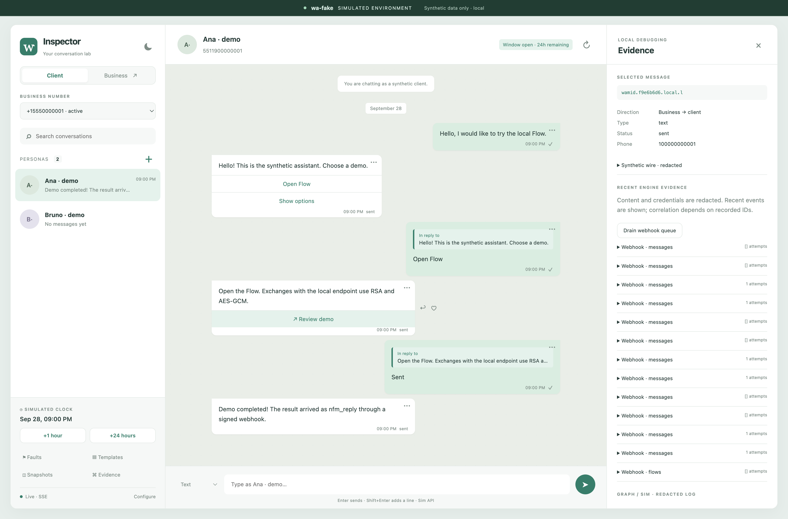

# wa-fake

A local WhatsApp Cloud API simulator for integration tests and development.

Point your application at a local Graph endpoint, receive signed webhooks, and interact with virtual customers in a browser. Test messages, media, templates and encrypted multi-screen Flows without a Meta account.

The inspector and TypeScript/Python SDKs share one engine. Unsupported capabilities fail explicitly. This is an independent MIT project, not affiliated with Meta or WhatsApp.



## Quick start

Requires Node.js 20+, pnpm 9, OpenSSL, Make and Python 3 for the runtime helper. Python 3.12+ and uv are needed for the Python SDK.

```sh
git clone https://github.com/jxnxts/wa-fake.git
cd wa-fake
corepack enable
pnpm install --frozen-lockfile
pnpm build
make up
```

Open **http://127.0.0.1:58991**. Select **Ana**, send `Hello`, and try the buttons, list and encrypted Flow. The demo application runs on port 58992. HTTPS Graph runs on port 58990 with a private local CA.

```sh
make status
make down
```

For development, run `pnpm dev` and `pnpm demo` in separate terminals. The inspector is built into the server; Vite is not required at runtime.

## Supported capabilities

- Text, media, location, contact, reaction, button, list, CTA and Flow messages; read/typing controls.
- Signed inbound webhooks, scheduled statuses, retries, virtual time and injected failures.
- Media upload, metadata, authenticated download, deletion and URL expiry.
- Template creation/review, positional/named parameters and rendered messages.
- Flow JSON validation, lifecycle/preview, RSA-OAEP/AES-GCM exchanges, headless sessions and `nfm_reply` completion.
- Vue inspector with customer/business views, live events, Flowso rendering, evidence, snapshots and themes.
- TypeScript client/in-process launcher and Python client/pytest fixture.

See the [fidelity register](docs/fidelity.md) for tested behavior, approximations and unsupported endpoints. Local tests do not establish Meta certification or complete Cloud API compatibility.

## Connect an application

Use Graph base URL `http://127.0.0.1:58991` or `https://127.0.0.1:58990`. For HTTPS, explicitly trust `.local/certs/ca.pem`.

`make up` starts separate HTTP demo and HTTPS test instances. Their state is independent. For an application connected to HTTPS, open the inspector at that same HTTPS origin after trusting the local CA.

| Setting            | Synthetic default |
| ------------------ | ----------------- |
| Graph version      | `v23.0`           |
| Phone number ID    | `100000000001`    |
| WABA ID            | `200000000001`    |
| Graph bearer       | `wa-fake-token`   |
| Simulator bearer   | `wa-fake-sim`     |
| Webhook app secret | `wa-fake-secret`  |

These are simulator credentials. Production-looking `EAA…` tokens are rejected. There is no Graph proxy; callbacks and Flow endpoints must be loopback addresses.

```sh
curl http://127.0.0.1:58991/health
curl -H 'Authorization: Bearer wa-fake-sim' http://127.0.0.1:58991/_wa/state
```

## TypeScript

```ts
import { createWaFake } from './packages/sdk-js/src/index.ts';
const wa = await createWaFake({ port: 0 });
try {
  const customer = wa.user('5511900000001', { name: 'Synthetic customer' });
  await customer.sendText('Hello');
  await wa.send(customer.waId, { type: 'text', text: { body: 'Hello back' } });
  const message = await customer.expectMessage({ type: 'text' });
  await customer.expectStatus(message.id, 'read');
  await wa.clock.advance('25h');
} finally {
  await wa.close();
}
```

## Python / pytest

```sh
uv sync --project packages/sdk-py
pnpm test:python
```

```python
def test_conversation(wa_fake):
    customer = wa_fake.user('5511900000001', name='Synthetic customer')
    customer.send_text('Hello')
    wa_fake.send(customer.wa_id, type='text', text={'body': 'Hello back'})
    message = customer.expect_message(type='text')
    assert message['payload']['text']['body'] == 'Hello back'
```

The fixture starts a checkout-local server. `WA_FAKE_URL` reuses a dedicated local instance; `WA_FAKE_CA_FILE` adds its CA. The fixture resets state, so use a separate instance from the interactive demo.

## Verification

```sh
make check
pnpm test
pnpm build
pnpm test:python
docker build -t wa-fake:local .
```

Tests cover an actual HTTP application journey, an external Kapso client, official response shapes, template validation, encrypted Flows, failure handling, TLS, authentication, media and snapshots. [Verification notes](docs/verification.md) distinguish local evidence from supplier testing.

## Documentation

- [Plan](docs/project-plan.md), [review](docs/plan-review.md), [tasks](docs/tasks.md)
- [Architecture](docs/architecture.md), [assumptions](docs/assumptions.md), [contracts](docs/contracts.md)
- [SDK guide](docs/sdk.md), [Quites integration](docs/integrations/quites.md)
- [Fidelity](docs/fidelity.md), [contributing](CONTRIBUTING.md), [third-party notices](THIRD_PARTY_NOTICES.md)

The repository is open source. npm/PyPI packages and registry-hosted images have not been released. Use this checkout or build the container locally. The container retains a loopback listener for tests inside the same container.

## License

MIT. Third-party material retains its original notices. Use synthetic data; snapshots contain conversation/form data even though evidence logs redact content and credentials.
