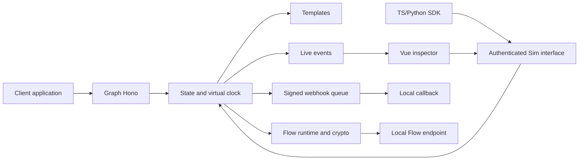

# Architecture

`core` owns state, validation and messaging rules. `graph` translates Cloud API wire contracts. `webhooks` builds envelopes/signatures/retry schedules. `templates` and `flows` are extensions through `EngineHost`. `server` composes modules and serves CLI, Sim and static inspector. SDKs are clients of the same interface.

The external seam is HTTP: an application changes its Graph base URL while retaining its production adapter. Deep module interfaces `sendMessage`/`receiveMessage` hide validation, windows, registration, status scheduling and webhook construction. `GraphExtension` returns `null` for routes it does not own and an explicit error for unsupported behavior.

Users/phones/media/templates/Flows/sessions are records keyed by ID; messages/webhooks/evidence are ordered arrays. Public state projects collections as arrays. Snapshots persist serializable runtime state; Flow runtimes are reconstructed after restore.

The inspector renders Flowso's `FlowScreen` from headless rendered state. Input/actions return through Sim, avoiding a second browser engine. It never directly calls the business Flow endpoint.

Trust: loopback binding, distinct Graph/Sim tokens, resource ownership before extension routing, no Graph proxy, no external callbacks/redirects, verified TLS chain, allowlisted evidence with no message contents or credentials.

The container is a loopback harness with application tests alongside the server. Bridge-network deployment is outside this initial contract.
